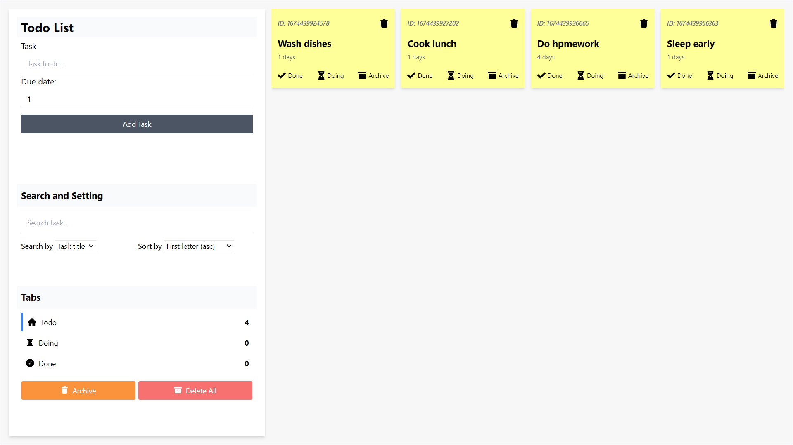
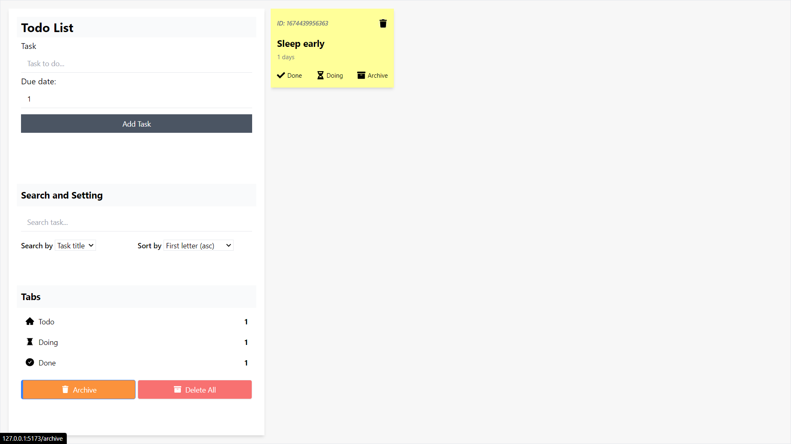
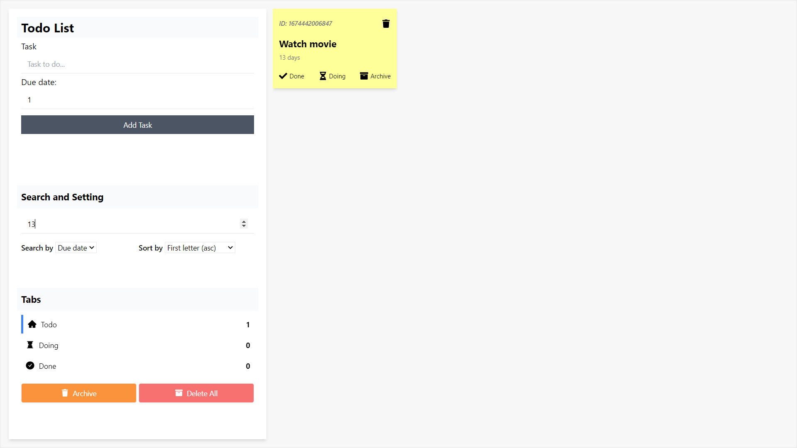
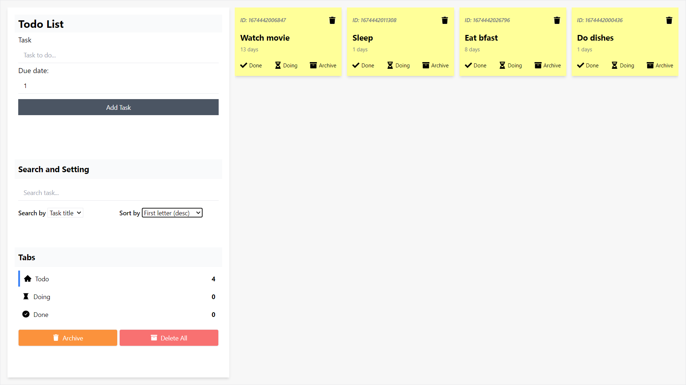

# TodoList Project

A semi-finished todo app project using React and TypeScript

## How to install:

1. Download everything as zip
2. Extract the zip then open the folder in terminal
3. Type and enter `npm i` to install the dependencies
4. The type and enter `npm run dev` to start the server
5. Enjoy!

## Techs used:

- [reactjs](https://reactjs.org/)
- [react-icons](https://react-icons.github.io/react-icons/)
- [tailwindcss](https://tailwindcss.com/)
- [TypeScript](https://www.typescriptlang.org/)

## Preview

Main tab

Ongoing Todo Tab

Done tab

Archive tab

Search by due

Search by title

Sort system

